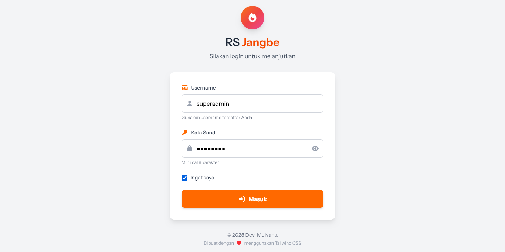
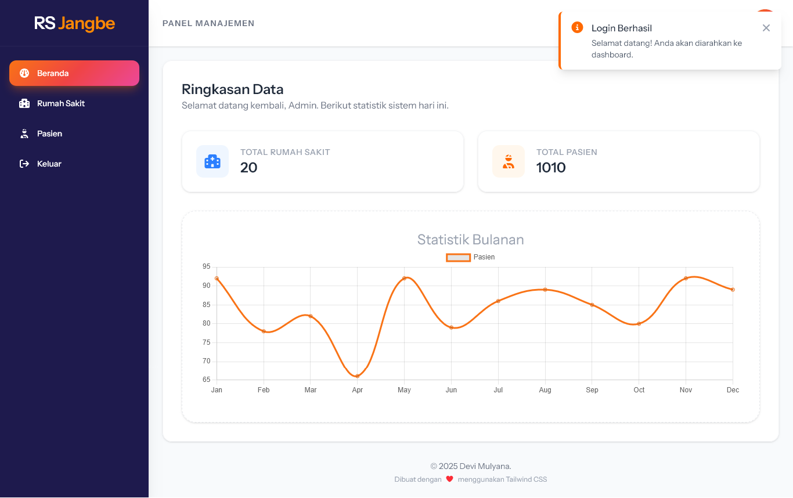
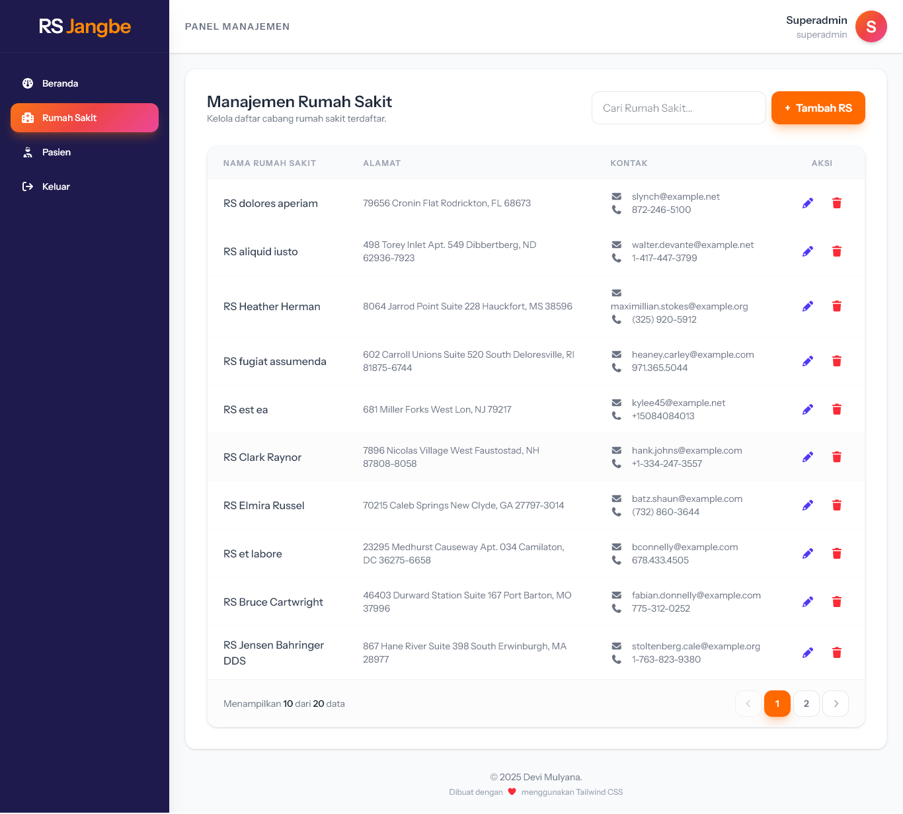
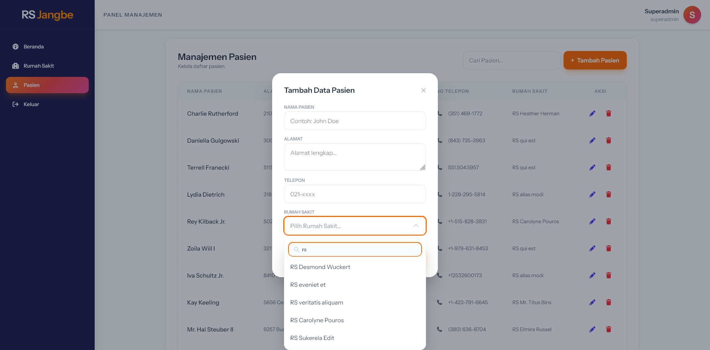

# Laravel - Vue 3 Management System (RS Jangbe)

Sistem Manajemen Rumah Sakit dan Pasien yang dibangun dengan **Laravel 12** dan **Vue 3 (Composition API)**. Project ini dikembangkan sebagai bagian dari pemenuhan _Technical Test_ untuk **PT Terakorp**.

## 🚀 Fitur Utama

-   **Admin Dashboard Layout**: Layout responsif menggunakan Tailwind CSS dengan _collapsible sidebar_ untuk penggunaan mobile.
-    **Interactive Dashboard**: Dashboard dinamis yang menyajikan ringkasan data secara visual:
        - **Animated Statistics**: Counter angka yang bergerak (animated numbers) untuk memberikan kesan interaktif saat halaman dimuat.
        - **Monthly Patient Line Chart**: Visualisasi data tren pendaftaran pasien bulanan menggunakan Chart.js.
-   **Advanced Searchable Select**: Komponen seleksi relasi data (Rumah Sakit ke Pasien) dengan fitur:
    -   **Infinite Scroll / Lazy Loading**: Integrasi langsung dengan Laravel Paginate API.
    -   **Live Search**: Pencarian data secara dinamis dengan _debounce_ untuk optimasi hit API.
    -   **Keyboard Navigation**: Navigasi opsi menggunakan tombol panah (_Arrow Keys_) dan _Enter_ untuk efisiensi input.
-   **CRUD dengan Modal**: Manajemen data Rumah Sakit menggunakan Modal yang interaktif dengan transisi halus (`Vue Transitions`).
-   **Data Pagination**: Implementasi sinkronisasi pagination antara backend Laravel dan frontend Vue 3.
-   **TypeScript Ready**: Penggunaan TypeScript pada komponen Vue untuk _type-safety_ yang lebih baik.

## 🛠️ Tech Stack

-   **Backend**: Laravel 12
-   **Frontend**: Vue 3 (Composition API)
-   **Styling**: Tailwind CSS
-   **Icons**: Font Awesome (Vue Component version)
-   **Language**: TypeScript & JavaScript

## 📦 Instalasi

1. **Clone Repository**

    ```bash
    git clone https://github.com/Jangbe/laravel_jangbe.git
    cd laravel_jangbe
    ```

2. **Backend Setup**

    ```bash
    composer install
    cp .env.example .env
    php artisan key:generate
    # Sesuaikan konfigurasi database di .env
    php artisan migrate --seed
    ```

3. **Frontend Setup**

    ```bash
    npm install
    npm run build
    ```

4. **Run Server**
    ```bash
    php artisan serve
    ```

## 📂 Struktur Penting (Frontend)

    resources/js/layouts/AdminLayout.vue: Kerangka utama admin dashboard.
    resources/js/components/CustomSelect.vue: Komponen custom select dengan fitur infinite scroll dan navigasi keyboard.
    resources/js/views/RumahSakit.vue: Halaman manajemen CRUD Rumah Sakit.
    resources/js/views/Pasien.vue: Halaman manajemen CRUD Pasien.

## 📝 Catatan Pengembangan

Dalam pengembangan ini, saya fokus pada User Experience (UX) seperti:

-   Menghindari submit form yang tidak disengaja saat berinteraksi dengan dropdown (menggunakan .prevent modifiers).
-   Optimasi performa API menggunakan debounce pada fitur pencarian.
-   Memberikan feedback visual berupa loading spinner dan transisi modal yang halus.
-   Mengintegrasikan library chart untuk memudahkan manajemen melihat tren data pasien tanpa harus membaca tabel secara manual.
-   Implementasi animasi pada komponen statistik untuk meningkatkan kualitas User Experience dan estetika aplikasi.

## 📸 Preview & Dokumentasi UI

<div align="center">
  
  <p><i>Halaman Login dengan Aksen Orange yang Konsisten</i></p>
  
  <br>

  
  <p><i>Halaman ringkasan data yang dilengkapi dengan fitur <b>Animated Numbers</b> dan <b>Line Chart</b> untuk memantau tren pendaftaran pasien secara visual.</i></p>

  <br>

  
  <p><i>Pengelolaan data Rumah Sakit menggunakan tabel responsif yang terintegrasi dengan sistem <b>Server-side Pagination</b> dari Laravel.</i></p>
  
  <br>
  
  
  <p><i>Formulir input di dalam Modal yang menggunakan komponen <b>Custom Select</b> dengan fitur <b>Infinite Scroll</b>, <b>Live Search</b>, dan navigasi keyboard.</i></p>
</div>


---

<div align="center">
Dikembangkan dengan ❤️ oleh <b>Devi Mulyana</b> untuk <b>PT Terakorp Indonesia Recruitment Team</b>.
</div>